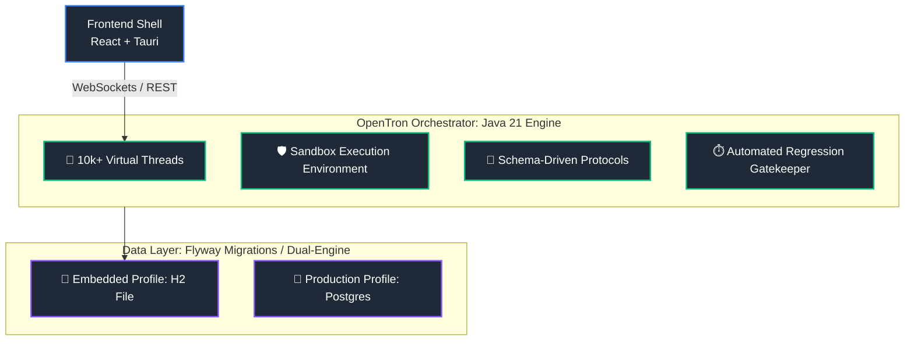

  
   
  <strong>Personal AI, On Personal Devices.</strong>
  
<i>Architecture Breakdown: How We Built a High-Density AI Agent Engine on a $1000 Budget While Silicon Valley Burns Millions</i>

---

We are independent software engineers from Eastern Europe. We didn’t have a multi-million dollar venture capital check, a corporate credit card to throw at AWS, or a team of 50 developers. 

What we had was a $1000 server budget and a refusal to accept the sloppy, unoptimized engineering choices that have taken over modern AI backend development. 

While elite tech spaces are pushing copy-paste Python scripts wrapped in infinite layers of cloud infrastructure to run multi-agent systems, we built **OpenTron**: a production-grade, highly concurrent, stateful AI multi-agent architecture running natively on Java 21, Spring Boot, and PostgreSQL.

Here is the exact data, the technical reasoning, and the benchmarks of how we out-engineered the cloud-hype machine for pennies.

---

## 🏗️ Architecture & Core Mechanics

OpenTron shifts multi-agent workflows from fragile prototyping to deterministic operation using a decoupled, highly concurrent architecture.

---

### 1. The Core Flaw of the Mainstream AI Hype Stack

The current industry trend is to build AI agents using Python runtimes (like FastAPI). When these applications are moved into production to handle long-running, asynchronous agent loops, they hit a massive architectural wall:

* **The Global Interpreter Lock (GIL) & Process Bloat:** Because Python cannot execute true parallel threads across multiple CPU cores natively, developers are forced to run multiple application worker processes (via Uvicorn/Gunicorn). This multiplies the application’s memory footprint immediately. 
* **The External Architecture Tax:** To handle long-running background tasks without locking up the web server, they have to string together a messy web of external infrastructure: Redis for message queues, Celery for background workers, and separate broker instances.
* **The Cloud Premium:** Every added worker process and infrastructure node consumes more RAM and CPU cycles. To keep this fragile setup from crashing under heavy traffic, startups pay an astronomical "lazy tax" to cloud providers, scaling horizontally across dozens of expensive container instances just to buy stability.

---

### 2. The Best-Practice Solution: OpenTron's Architecture

We chose to bypass the entire abstraction layer and build OpenTron directly on the modern JVM. By pairing Java 21’s Virtual Threads with a tightly optimized relational data layer, we removed the need for expensive infrastructure entirely.

## 💰 The Financial Reality: Hardware Meltdown vs. JVM Efficiency

Silicon Valley solves concurrency by throwing venture capital at cloud providers. Python-based agent frameworks treat compute hardware as an infinite, free resource—resulting in unoptimized systems that melt down server infrastructure under actual enterprise workloads. OpenTron uses the JVM to extract maximum structural value out of every single dollar spent on bare metal.

### 📊 Asymmetrical Economic Breakdown

```mermaid
flowchart TD
    %% Python Path (Top)
    subgraph Python [PYTHON Stack: Hardware Overload 💸]
        direction LR
        A1[Memory Bloat:<br>Heavy Process Forks] --> A2[CPU Core Throttling:<br>High System Overhead]
        A2 --> A3[Process Desync:<br>Fragile State Retention]
        A3 --> A4[Infrastructure Up-scaling:<br>\$500+/mo Lazy Tax]
    end

    %% Invisible structural linker to force top-to-bottom layout stacked order
    A2 ~~~ B2

    %% OpenTron Path (Bottom)
    subgraph OpenTron [OPENTRON Stack: Maximum Saturation 👑]
        direction LR
        B1[Virtual Threads:<br>10k+ Lightweight Loops] --> B2[Continuous Pipeline:<br>Zero-Waste I/O]
        B2 --> B3[Thread Sharing:<br>In-Process Consolidation]
        B3 --> B4[100% Resource Efficiency:<br>Under \$100/mo Budget]
    end

    %% Modern Native Styling
    style Python fill:#1a1110,stroke:#f87171,stroke-width:2px
    style OpenTron fill:#0f1715,stroke:#34d399,stroke-width:2px
    style A1 fill:#2d1a18,stroke:#ef4444,color:#fff
    style A2 fill:#2d1a18,stroke:#ef4444,color:#fff
    style A3 fill:#2d1a18,stroke:#ef4444,color:#fff
    style A4 fill:#2d1a18,stroke:#ef4444,color:#fff
    style B1 fill:#062f21,stroke:#10b981,color:#fff
    style B2 fill:#062f21,stroke:#10b981,color:#fff
    style B3 fill:#062f21,stroke:#10b981,color:#fff
    style B4 fill:#062f21,stroke:#10b981,color:#fff
```

---

### 📉 Cost & Performance Architecture Comparison

| Economic & Operational Metric | The Python Crash Loop  *(LangChain / CrewAI / FastAPI)* | OpenTron Value Engineering  *(Java 21 / Spring Boot)* |
| :--- | :--- | :--- |
| **Memory Utilization Profile** | **Hardware Meltdown:** Every new worker process forks the runtime environment, cloning dependencies and leaking RAM fast. | **High Density:** 10,000+ tasks share a single JVM footprint. Memory scales predictably in kilobytes, not gigabytes. |
| **API & I/O Latency Handling** | **Paid Compute Wastage:** Idle execution pipelines lock up OS threads while waiting for LLM token responses, burning paid CPU cycles doing absolutely nothing. | **Zero-Waste Allocation:** Virtual threads unmount during network waits. The underlying hardware switches to other compute tasks instantly. |
| **Background Threading Cost** | **Infrastructure Tax:** Forcing Python to handle background background tasks requires separate billing for Redis brokers and Celery instances. | **In-Process Consolidation:** Complete agent orchestration, job queues, and task dispatching run concurrently inside one single container. |
| **Hardware Lifecycle ROI** | **Premature Upgrades:** Server nodes hit early limits due to process scaling overhead, requiring immediate horizontal cluster upgrades. | **Total Hardware Saturation:** Pushes cheap, low-spec hardware to 100% computational capacity before needing to scale out. |
| **Development Lifecycle Value** | **Fragile Maintenance:** Dynamic runtime type errors manifest midway through complex, expensive production runs. | **Compile-Time Safety:** Strong static typing catches execution formatting issues *before* running expensive LLM API queries. |

---

## 📄 License

This project is licensed under the Apache-2.0 license.
