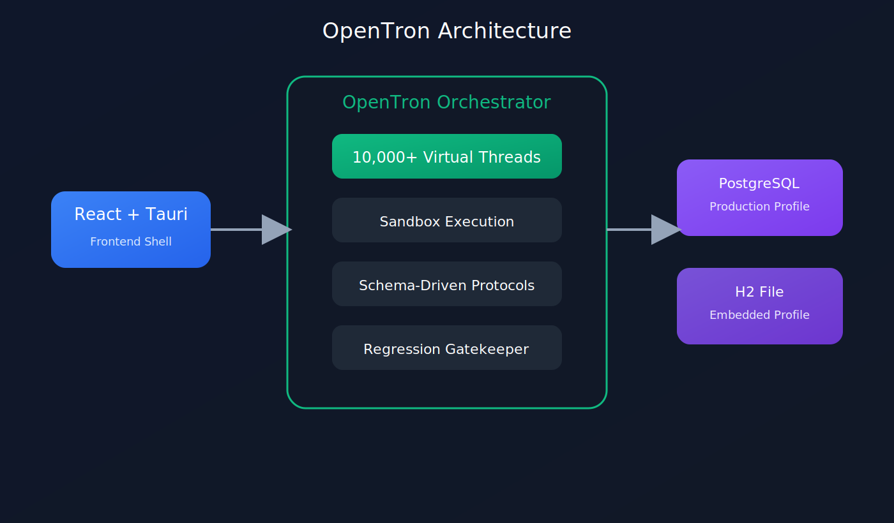
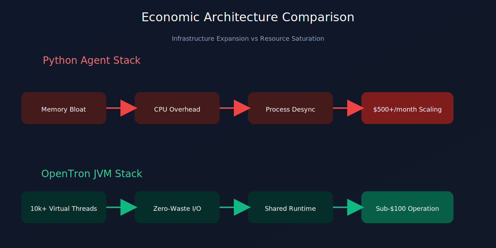

  

<h3 align="center">
Personal AI, On Personal Device
 
<em>How We Built a High-Density AI Agent Engine
    on a $1000 Budget While Silicon Valley Burns Millions
  </em>

</h3>

---

We are independent software engineers from Eastern Europe.

We didn't have a multi-million dollar venture capital check, a corporate credit card to throw at AWS, or a team of 50 developers.

What we had was a $1000 server budget and a refusal to accept the sloppy, unoptimized engineering choices that have taken over modern AI backend development.

While elite tech spaces are pushing copy-paste Python scripts wrapped in layers of cloud infrastructure to run multi-agent systems, we built **OpenTron**: a production-grade, highly concurrent, stateful AI multi-agent architecture running natively on **Java 21**, **Spring Boot**, and **PostgreSQL**.

This document explains the architecture, design rationale, and benchmarks behind the system.

---

# 🏗️ Architecture & Core Mechanics

OpenTron shifts multi-agent workflows from fragile prototyping to deterministic operation using a decoupled, highly concurrent architecture.

  

---

## 1. The Core Flaw of the Mainstream AI Hype Stack

The current trend is to build AI agents with Python runtimes such as FastAPI.

As systems scale into production, several architectural issues emerge:

- **Process Multiplication** – Scaling concurrency often requires additional workers.
- **Infrastructure Sprawl** – Queues, brokers, schedulers, and worker clusters become mandatory.
- **Operational Cost Growth** – More infrastructure means more memory, more CPUs, and larger monthly bills.

---

## 2. OpenTron's Approach

Instead of layering services around runtime limitations, OpenTron is built directly on the modern JVM.

By pairing:

- Java 21 Virtual Threads
- Spring Boot
- PostgreSQL
- Strongly Typed Contracts

we achieve massive concurrency while keeping operational complexity low.

---

# 💰 Economic Reality: Hardware Saturation vs Infrastructure Expansion

  

### 📉 Cost & Performance Architecture Comparison

| Economic & Operational Metric | The Python Crash Loop  *(LangChain / CrewAI / FastAPI)* | OpenTron Value Engineering  *(Java 21 / Spring Boot)* |
| :--- | :--- | :--- |
| **Memory Utilization Profile** | **Hardware Meltdown:** Every new worker process forks the runtime environment, cloning dependencies and leaking RAM fast. | **High Density:** 10,000+ tasks share a single JVM footprint. Memory scales predictably in kilobytes, not gigabytes. |
| **API & I/O Latency Handling** | **Paid Compute Wastage:** Idle execution pipelines lock up OS threads while waiting for LLM token responses, burning paid CPU cycles doing absolutely nothing. | **Zero-Waste Allocation:** Virtual threads unmount during network waits. The underlying hardware switches to other compute tasks instantly. |
| **Background Threading Cost** | **Infrastructure Tax:** Forcing Python to handle background background tasks requires separate billing for Redis brokers and Celery instances. | **In-Process Consolidation:** Complete agent orchestration, job queues, and task dispatching run concurrently inside one single container. |
| **Hardware Lifecycle ROI** | **Premature Upgrades:** Server nodes hit early limits due to process scaling overhead, requiring immediate horizontal cluster upgrades. | **Total Hardware Saturation:** Pushes cheap, low-spec hardware to 100% computational capacity before needing to scale out. |
| **Development Lifecycle Value** | **Fragile Maintenance:** Dynamic runtime type errors manifest midway through complex, expensive production runs. | **Compile-Time Safety:** Strong static typing catches execution formatting issues *before* running expensive LLM API queries. |

---

## 📄 License

This project is licensed under the Apache-2.0 license.
